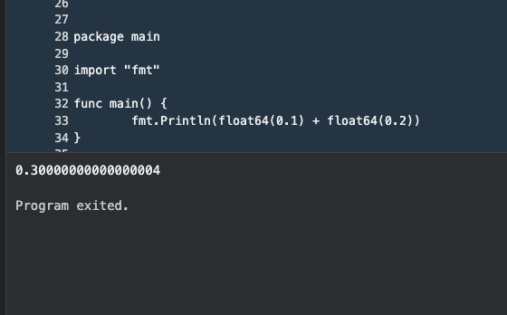
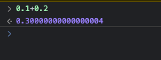
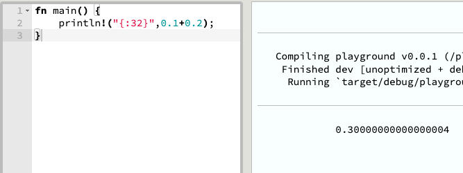
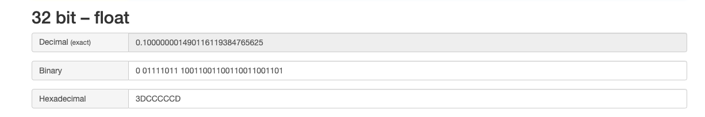
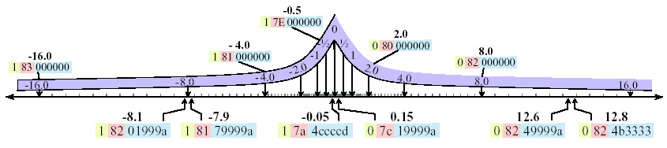

I can still remember in one of my interview, I was once asked, "**What data type would you use for handling currency in a programming language**". My answer to this was "**double or float**", believing these data types were the best choice
for maintaining the accuracy of currency values. However, upon further research after the interview, I realize I was dead wrong. In contrary, it turns out that using floating-point types can lead to unexpected inaccuracies. This is due to
the specific way these data types are implemented and handled in programming language.

This realization led me to delve deeper into intricacies of floating-point types. In this article I will share my findings, explaining how computer handle floating point under the hood.

In the realm of computer hardware, there are generally two types of CPU; those with a **Floating Point Unit (FPU)**, those without it. FPU, as the name suggests, is responsible for handling floating point number, a type of representation used in computer systems to handle numbers with decimal points. Most of the CPU nowadays has FPU built in, CPU such as Intel's Core series (i5,i7,i9) and AMD's Ryzen
series. This CPUs are designed to handle wide range of tasks, and some task might involving handling floating value. On the other hand, some CPUs, particulary those which designed to handle limited functions may not need FPU built in. This is often the case for microcontrollers, which are small, low cost which used in embedded system. However, here we will focus on how most of our computer handle floating point, specifically, how FPU handle them.

So what exactly do I mean by inaccuracies of floating point numbers? To understand this, try coding this expression `0.1+0.2`. You can do it in any language, let it be **Rust**, **Go**, **Javascript** and etc.

Chances are no matter which language you are using, you are going to get the same result, which is `0.30000000000000004`. But why? We all know that the answer should be `0.3`, where does this `0.00000000000000004` came from?

Before we delve into how floating point works, let's refresh our memory on how integer works in the world of machine. Integers are always represented in bytes, as this is the unit of data that machines comprehend. We know that 1 byte equals 8 bits, and the size of integers is typically represented in bits across most programming languages.
Integer sizes can vary, ranging from **8 bits, 16 bits, 32 bits, to 64 bits**. The larger the bit size of the integer, the greater the value that the variable can hold. For instance, if we declare a variable as an unsigned integer with a size of 8 bits, the maximum value this variable can hold is 255 (2 raised to the power of 8). If you attempt to perform an operation like 255+1, which exceeds this limit, an **overflow** will occur. On the other hand, a signed integer of 8 bits provides a number range from -128 to 127, with half of the range representing negative numbers and the other half representing positive numbers. For floating-point numbers, the most common sizes are **32-bit and 64-bit**. These bits are partitioned to represent both the **integral part** and the **fractional part** of the number. This division allows us to efficiently handle a wide range of values, from tiny fractions to substantial integers, all within the confines of a fixed number of bits.

Converting our everyday decimal numbers into binary code is usually a pretty straightforward process - just a basic switch from base 10 to base 2. But when it comes to floating-point numbers, well, that's where things get a bit more interesting. In the realm of computers, the translation of these floating-point numbers falls under the command of a set of rules known as the **IEEE 754 standard**.

Under this standard, we've mainly got two types of floating-point precision. There's the single-precision format, which is stored in 32 bits and can accurately depict around 7 decimal digits, and there's the double-precision format, spreading out across 64 bits, and it can represent about 15 digits. Even though the precision levels are different, the basic conversion formula remains the same, breaking the bits down into three main parts:

1. **Sign bit**: This is the first bit in line in our 32 or 64-bit floating point number. A '0' here signals that the number is positive, while a '1' tells us it's negative.
2. **Exponent**: Next up, we have an 8-bit section for 32-bit floats and an 11-bit section for 64-bit floats. To find the actual value of the exponent, we subtract 127 for the 32-bit format, or 1023 for the 64-bit format. This process is known as **biasing the exponent**, and it allows the system to work with both positive and negative exponents. For the 32-bit format, we use a bias of 127, which gives us an exponent range from -128 to 128. For the 64-bit format, a bias of 1023 gives us a range from -1022 to 1023.
3. **Significand (Mantissa)**: The remainder of the bits (23 for 32-bit, 52 for 64-bit) form the significand. One quirk of the IEEE 754 standard is that it includes an implicit '1' before the binary point in the significand. This '1' is normalized and not actually included in the stored binary representation. So the significand part of the floating point number is always going to look something like 1.xxxxxx.

Let's work on some example. Say we want to convert the decimal number 18.75 into IEEE 754 32-bit floating point format.

1. **Identify the sign**: 18.75 is positive, hence the sign bit is 0. 2. **Convert the integer part to binary**: The binary of 18 is 00010010.
2. **Convert the fractional part to binary**: To convert the fractional part (0.75) to binary, we need to keep multiply by 2, keep the integer part and repeat with the fractional part until it become zero.

   0.75\*2=1.5 (keep the 1, continue with .5)

   0.5\*2 = 1.0 (keep the 1, continue with 0)

   End up the binary of 0.75 is .11 in binary. Thus, 18.75 in binary is 10010.11

3. **Normalize the binary representation**: We then adjust is so there's exacly one non-zero digit before the point. So, 10010.11 become 1.001011 \* 10^4 in scientific notation. So our exponent is 4.
4. **Adjust the exponent and convert it into binary**: We use _biasing_ to allow the exponent to be both positive and negative as mentioned earlier, hence we add 127 to the exponent, 4+127=131. In binary, 131 is 100000011.
5. **Prepare the significand (Mantissa)**: Take the fractional part of the normalized number, and fill in the rest of the zero until we have 23 bits. So we will have 00101100000000000000000

Now let's put it together,

- Sign bit: 0
- Exponent: 100000011
- Significand: 00101100000000000000000

So 18.75 in IEEE 754 32-bit floating point format is **010000001100101100000000000000000**.

The above example works fine and we can get the precise binary value, however there are numbers which we cannot precisely represent in binary format. Take _0.1_ for example, which shown in above figure where we are getting 0.30000000000000004 from `0.1 + 0.2`.

1. **Identify the sign**: 0.1 is positive, hence the sign bit is 0.
2. **Convert the integer part to binary**: There's no integer part in this case, so we can skip.
3. **Convert the fractional part to binary**: Converting 0.1 to binary is an interesting task because 0.1 results in a repeating binary fraction.
   0.1\*2=0.2 (Keep the 0, continue with .2)

   0.2\*2=0.4 (Keep the 0, continue with .4)

   0.4\*2=0.8 (Keep the 0, continue with .8)

   0.8\*2=1.6 (Keep the 1, continue with .6)

   0.6\*2=1.2 (Keep the 1, continue with .2)

   You'll notice that we're back to 0.2 again, which means from this point the pattern (00011) will repeat indefinitely. So, we represent 0.1 as .0001100110011 in binary with the understanding that the pattern repeats.

4. **Normalize the binary representation**: The binary equivalent of 0.1 is 0.0001100110011 (repeating). To normalize it, we need to move the binary point four places to the right, which gives us 1.1001100110011 (repeating) x 2^-4. Our exponent is -4.
5. **Adjust the exponent and convert it into binary**: For single-precision, we add 127 to the exponent to get the biased exponent. So, -4 + 127 = 123. In binary, 123 is 01111011.
6. **Prepare the significand (Mantissa)**: We take the fractional part of the normalized number, drop the leading 1 (since it's implicit), and fill the rest with the repeating pattern until we have 23 bits. This gives us 10011001100110011001101 (note that we've had to **truncate** the repeating pattern and this is the part where the precision of the floating point got affected).

We end up getting 0 01111011 10011001100110011001101.

Now, we've got our single-precision floating point binary representation of the number 0.1! But here's where the intrigue of floating-point numbers kicks in. Remember how we had to truncate that repeating pattern to fit our 23-bit limit for the significand? That truncation is essentially where we lose some precision. In fact, if you convert this binary back to decimal, you'd get something close to, but not exactly, 0.1.

And this explain why when we are trying to perform `0.1+0.2` we don't get exactly `0.3`, as the computer trying to perform addition operation on approximation of `0.1` and approximation of `0.2`, not the exact values. So when you add them up, you're adding both slightly "off" numbers. That leads to another approximation. The result are still in binary,it needs to be converted back into decimal form to be displayed, and here's the kicker, when convert it to decimal the computer will use some _rounding algorithm_ to round the results so that it will make sense in decimal form. This rounding can cause some tiny discrepancies, which we called **rounding error**. That's how the `0.00000000000000004` came from. There are several rounding algoritm, and different programming uses different methods, but that's a topic for another day.

If you align the floating point numbers into a number line, you will find that their distribution is not even accross the number line. In fact, they're more densely packed around zero, and the spacing increase as you move away from the zero in either positive or negative direction. This happen because the way floating point is constructed, as mentioned above some portion are dedicated to the exponent, some to the significand. **When the value represent by the exponent increases, the gap between 2 consecutive floating point number also increases**. In short, floating point numbers become less precise when their magnitude increases.

Image retrieved from [the source](https://www.researchgate.net/figure/The-non-uniform-distribution-of-floating-point-numbers-implies-that-the-same-absolute_fig2_228807601)

Wrapping it up, we've had a quite a journey through the bits and bytes of the world of floating point numbers. This is something crucial to bear in mind, especially when you're dealing with numerical computations where precision is key. Try not to do stuff some like this `if x == 0.3`, you might shoot your own foot doing this. When floating point aren't quite cutting it, when accuracy does matter, there are an array of alternatives like **fixed-point arithmetic**, **fractions**, **symbolic computation** and etc.
