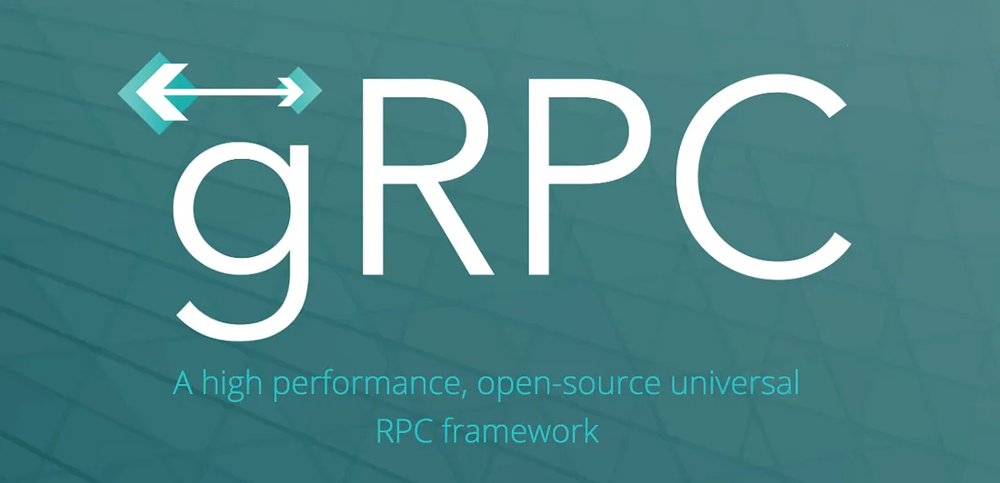

# TL;DR

**REST** is always the go-to architecture when somebody wants to build an **HTTP API** for communications, in particular with a file format called **JSON**. This is the new norm, “trending” and common approach, nothing wrong with it. But just because everybody doing it does that make it a legit option when it comes to certain use cases? We all should look at the problem that we are trying to solve first before coming to a decision on which technologies to use. In this article, we are going to discover another option, **RPC**, specifically **gRPC**.

# What is gRPC?

**gRPC** is an open sources project developed by Google in 2015 on top of RPC framework. To understand this, you have to know what is **Remote Procedure Call(RPC)** means. **Procedure** is also known as functions, it exists in any programming language paradigm.

The term **Remote**, means that the procedure can be called distributedly by any client/server. Rather than an **HTTP** call, **RPC** is a communication that uses a direct function call **without co-existing in the same address space**.

With the rise of **microservices** in recent years, **RPC** started to gain popularity mainly because of how **RPC** fits into solving microservice problems. Service to service communication happens a lot in microservice, you might also have different services written in a different programming language. With **gRPC**, it brings performant, and support to help solve the issue.

**gRPC** supports a number of programming languages. It allows different services to communicate with each other regardless of what programming language each service is written.

> Well, I can also achieve these easily by creating REST endpoint from one service and calling this endpoint from another service that used whatever language, as long as I am able to serialize the expected response from this single endpoint right?

Technically yes, but **gRPC** can save you a lot of work while giving you a performance **boost** as well!

By default **gRPC** use protocol buffers as the **Interface Definition Language**, which are Google’s language-neutral, a platform-neutral mechanism for serializing structured data into **bytes** of data. All you need to do is just define the data structure of payload message and service interface for communication between services, **protobuf (protocol buffers)** will generate the source code either for server-side or client-side in whatever language you needed for you to easily write and read the structured data.

But of course, this is limited to the language that **gRPC** currently supports, but don’t worry most of the most used languages are on the cover. **Java, Python, Ruby, Go, C#, and etc**, you name it! This is particularly important and beneficial for a distributed systems like microservices when you have different services in different programming languages.


_Simple example of defined data structure in protocol buffers language_

With the above-defined data structure that you will be creating in `.proto` file, **protobuf** will generate the code easily with just simple command which I will showcase later in this article. So yes, this does make your life easier with all the generated codes, but how about the performance buff that I mentioned earlier? Of course, when I talk about performance boost, I am comparing it with the most widely used API architecture, **RESTful API**. So lets get into a little bit of **REST** and how’s **gRPC** better in performance.

# REST vs gRPC

As most of us know that **REST API** which stands for **REpresentational State Transfer**, is the big boy in the industry, anyone will get in touch with it as long as you are developing something. **REST** is widely used because of how direct and simple it is. **JSON** is the most generally popular file format that is used to deliver across **HTTP** because of its language-agnostic and is also readable by both humans and machines. Besides that, **REST** follows the **HTTP** principle, for example, the **HTTP** methods that we always saw **(GET,POST,PUT,DELETE)**, this brings the advantage of getting more insight into what kind of API endpoint you are dealing with over time to time.

On the other hand, gRPC leverages **HTTP/2.0** as its transfer protocol. **HTTP2** delivers major enhancement on **TCP** connection. Below are some of the stand out enhancements for **HTTP2** over **HTTP1**:

1.  **HTTP2** employs binary encoding which is much more efficient for processing compares to **HTTP** which utilizing plain text.
2.  **HTTP2** adapts the concept of stream, which is fully **asynchronous**. Client and servers can both initiate multiple streams on a single **TCP** connection. While **HTTP** as we know using a single request and response flow which the client had to wait for the server to respond before the next request.

So with **gRPC** leveraging **HTTP2**, it also shares the benefits from many advantages mentioned above:

- With **protobuf**, the data format is transferred in **binary format** compare to **JSON/XML** which are text-based, this makes files **smaller** in size and **faster serialization**.
- **gRPC** provides 4 kinds of service methods:

1.  **Unary RPCs**, just like REST, the client sends a single request and gets a single response from the server.
2.  **Server streaming RPCs**, client send request where the server will return streams of data for the clients to read until there are no more messages left.
3.  **Client streaming RPCs**, the client writes a sequence of message and send to the server through streams, it will wait for the server to finish reading and return its response
4.  **Bidirectional Streaming RPCs**, both server and client send a sequence of messages using read-write stream. The 2 stream operates independently.

All these perks stated above are every reason why **gRPC** is faster and efficient compare to **REST**. How fast? you ask. Take a look at the below figure,


_Image Source:_[_linkedin.com/pulse/comprehensive-performanc.._](https://www.linkedin.com/pulse/comprehensive-performance-bench-marking-experiment-compare-chakilam/)

# What do we know so far?

We have been talking about what **gRPC** is and how it is different from **REST API**, lets redefine the whole thing in a much simpler way to make things much clearer.

- **REST API** -> work with JSON/XML (text format)
- **gRPC** -> work with Protobuf message (stream of bytes)
- **REST API** -> uses HTTP 1.1
- **gRPC** -> uses HTTP/2
- **REST API** -> supports request-response model only
- **gRPC** -> supports request-response, client streaming, server streaming and birectional streaming (took advantage of HTTP/2)

# When to use gRPC then?

Like we mention in the beginning, there are no single tools that are able to solve all the problems we faced. Choose your technology wisely based on the problem you are trying to solve.

Although **gRPC** brings performance in a distributed system, currently it has **low browser support** because no modern browser can access **HTTP/2** frames yet. So **REST** is still stood out when it comes to a scenario where you need to serve the browser. **gRPC** is more limited to internal systems.

When **real-time streaming calls** are what we dealing with, gRPC can fit like a glove to solve the problem as it supports bidirectional streaming as well.

Lastly, thanks to **protobuf**, which supports code generation for multiple languages, making multi-language communication no issue at all.

# Enough for all these theories, let’s dive into the code!

In this article, we will look at how to create a very simple **gRPC** unary service(request/response) just to have an overall picture of what **gRPC** looks like.

To showcase one of the edges that gRPC brings which ease multi-language communications between services, we will create a server using [**Golang**](https://golang.org/) and a client using [**C#**](https://docs.microsoft.com/en-us/dotnet/csharp/) for the demonstration.

This is the overall architecture diagram that we are going to build:


# Disclaimer

This tutorial expects you to know at least the basic of **golang/dotnet(c#)**, we will only cover how to create **gRPC** service, here are some references where you can learn the basics from:

[https://golang.org/doc/tutorial/getting-started](https://golang.org/doc/tutorial/getting-started)

[https://dotnet.microsoft.com/learn](https://jefftechhub.hashnode.dev/Link)

# Creating gRPC Server (Go)

**Prerequisites**

Before we start, there are packages needed to be installed on your machine.

Protocol Buffers Compiler :

In order to compile the .protoc file, which contains all service and message definitions, we need a protocol buffer compiler to do so.

- For Linux user

```bash
$ apt install -y protobuf-compiler
$ protoc --version

```

For MacOS, use [**Homebrew**](https://brew.sh/)

```bash
$ brew install protobuf
$ protoc --version
```

you can also download from [**here**](https://github.com/protocolbuffers/protobuf/releases/tag/v3.17.3) which consists of different releases precompiled binary.

Let’s start with creating a simple **gRPC** server that is able to send greeting messages to the client that request from the server.

We will use [**Go Modules**](https://go.dev/blog/using-go-modules) for package management. use `go mod init projectname` to initialize the **go.mod** file.

go mod init grpc

The protocol buffer compiler requires different plugins for different language code generate, in this case, we are using golang for the server so let’s start by installing the package using `go get`.

go get -u github.com/golang/protobuf/protoc-gen-go

Now we have the package install, let proceed to write our program start-off point which is our main function with logic that is able to listen on a port for incoming **TCP** connections:


main.go

Next, let’s create the function that our gRCP client can interact with by defining the message and contract in the `.proto` file. Message referring to the object or model that will be used in the functionality while contract refers to the description of the method or function itself, like what are the arguments expected to call this function and also what return type this function return. Let’s define everything we need for our greeting service in `greet.proto` file.

Here is the file structure for the proto file:


file structure for protobuf


greet.proto

The `syntax` here refers to the syntax used in this proto file as proto3 syntax. In order to generate the go code from protobuf, we need to define the import path in the `.proto` file, there are 2 ways to do so, one is like what we are currently doing, we declare it in the *.proto* file, another way would be declaring it in the command line when invoking protoc. [**Google official**](https://developers.google.com/protocol-buffers/docs/reference/go-generated) recommended declaring it in the **_.proto_** file for simplification. So we can declare it In the file by assigning the path of this package `greet`. `service` here referring to the method contract that the client must fulfill in order to call this service and the `message` descript the request and response object.

With this **_.proto_** file created, it exposes the **_GreetService_** which consists of our **_Greeting_** function that can be called by any **gRPC** client written in any language.

Once we have our **_.proto_** file, this file can share across to any client for their own code generation so that they can communicate with our **gRPC** server.

Now let’s generate our **Go gRPC** code using the protobuf compiler that we installed in our machine. To make things easier in environment setup and configuration, we will use [**make**](https://opensource.com/article/18/8/what-how-makefile) to run the protobuf command. To do so, create a **_Makefile_** at the root of your project. Then write down the command below:

```makefile
generate-protobuf:
 @rm -rf grpc-service/${name}/go/** && protoc -I=grpc-service/${name}/proto --go_out=paths=source_relative:grpc-service/${name}/go --go-grpc_out=paths=source_relative:grpc-service/${name}/go grpc-service/${name}/proto/\*.proto
```

and run the makefile command:

make generate-protobuf name=greet

What the command does is it will first remove any file found inside the file path that we specify, In this case, `grpc-service/greet/go/`. Noted that the `${name}` stands for any variable you input when you run the make command. After removing existing files, we then run `protoc` by specifying the input folder which tells the protoc where to place our generated code. `go_out` flag here specify a location for our **_'.pb.go'_** file which contains code for **populating**, **serializing**, and **retrieving** our `GreetingRequest` and `GreetingResponse`, while the `go_grpc_out` specify the file path for **_'pb.grpc.go'_** file which contains **generated client and server code**. Lastly, we also need to specify the location of our *.proto* files that `protoc` will compile.

You’ll see generated file `greet_grpc.pb.go` and `greet.pb.go` files generated under the path we had specified.

Now that we have our code generated, is time to call and register the service on our server, let’s do this in our main function:


main.go

What we did here is to create a **grpc server** which has our **GreetService** registered. As you can see the `RegisterGreetServiceServer` method is created by protoc to help us register our service to the server, cool right?

So now we had our service registered, what next? What does the service do actually? We do not yet have that defined. This is what we are going to do next, define what **Greeting** method does.

Create a `handler` folder which contains a greet.go file.


handler folder


greet.go

Alright, we are all set up for the gRPC server, now let’s run our code:

```bash
$ go run main.go
```

TADAA! Our new **gRPC server** is now running on **localhost:8000**.

# Creating gRPC Client (.NET 5, c#)

Let us start by create a new .NET gRPC client project.

```bash
dotnet new console -o GrpcGreeterClient
code -r GrpcGreeterClient
```

**Prerequisite**

you need to have the following package for gRPC client in .NET, run the command below to add:

dotnet add GrpcGreeterClient.csproj package Grpc.Net.Client  
dotnet add GrpcGreeterClient.csproj package Google.Protobuf  
dotnet add GrpcGreeterClient.csproj package Grpc.Tools

Next, let’s create the `greet.proto` files under `Protos` folder.


greet.proto file structure

As I mentioned earlier when we are building the gRPC server, the `.proto` file can be shared across to any client that which to communicate with the server, so what we going to do now is super simple, just **_copy_** and **_paste_** the content of `greet.proto` from our gRPC *server* to the `greet.proto` of our *client*.


greet.proto

Noted that there do have some minor modifications on the **_‘greet.proto’_** file, which is our option, we need to update it to our project’s namespace.

Go to the `GrpcGreeterClient.csproj` project file and add an item group which helps refer the `greet.proto` file path.

```
<ItemGroup>
  <Protobuf Include="Protos\greet.proto" GrpcServices="Client" />
</ItemGroup>
```

Now that we have done our gRPC client set up, let’s create the client and eventually call the **Greeting** method we defined in our gRPC server.


program.cs

Lastly, let’s run build and run the client to see if we can successfully communicate with the server.

```
$ dotnet run
```


result

Amazing! We now have a **gRPC client** that talks to our **gRPC server**!!

# Conclusion

In the nutshell, we can see how **gRPC** is a great option when comes to **microservice** architecture, where you have multiple services communicate which each other or environment which involves multi-language communications. My senior once told me, when your server is involved in human communication like feeding data to the UI/frontend to populate, it makes sense to use **REST** or **GraphQL** which are more human friendly, but when it comes to machine to machine communication which happens a lot in a microservice architecture, it’s makes more sense to communication with **bytes** instead of **text**, because machine talks **binary** right?
