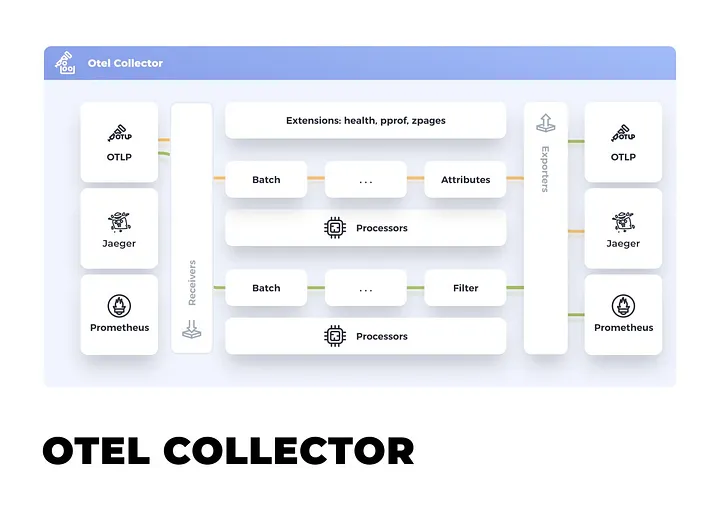
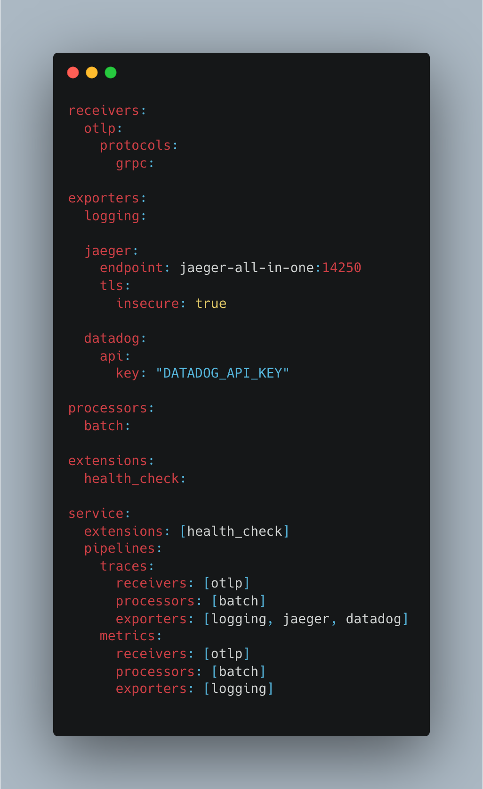
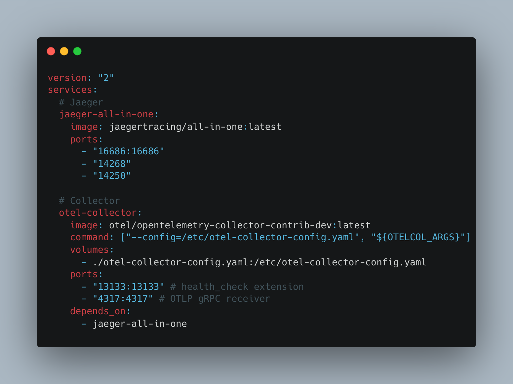
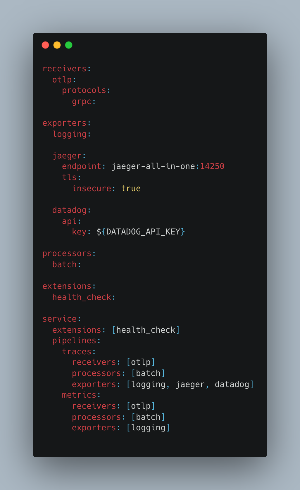
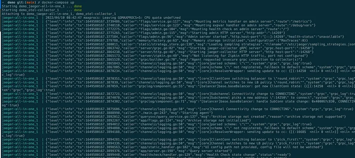
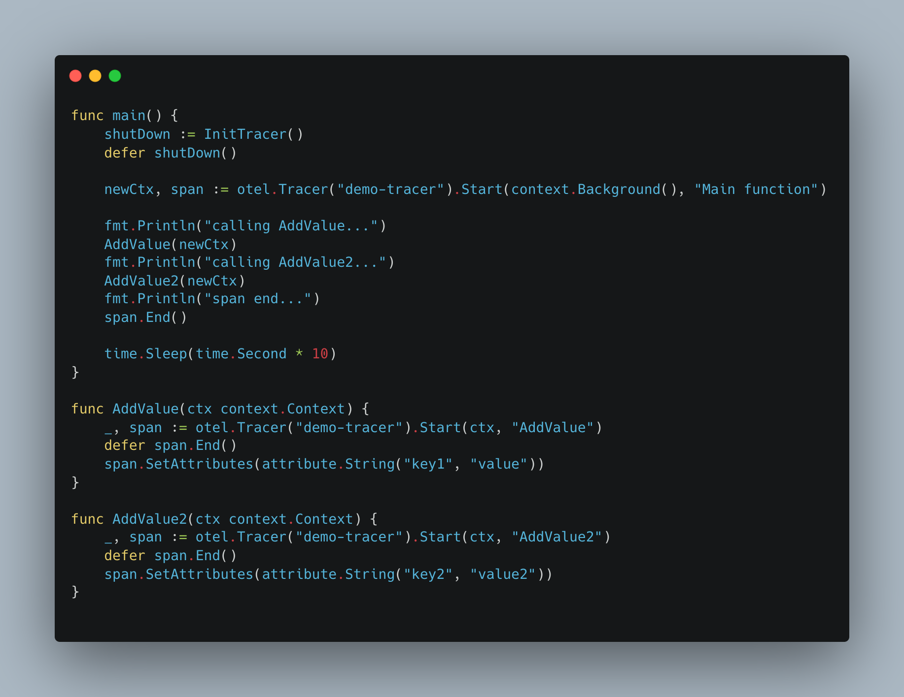
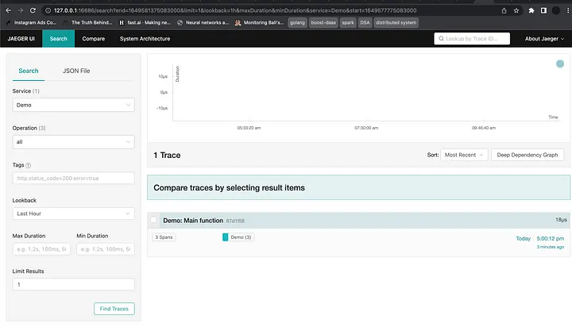
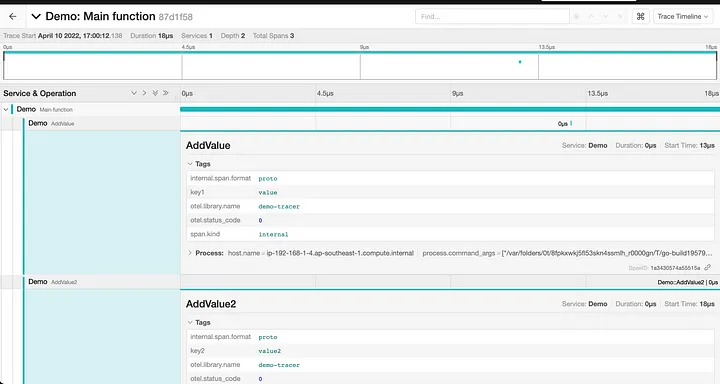
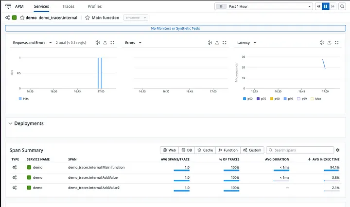
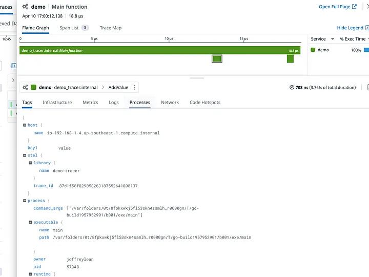



# **TL;DR**

Recently I’ve been assigned to work on a project where I need to integrate with **datadog** for observability. The project itself already uses **jaeger**
for distributed tracing, and due to some reason, we need to integrate with datadog as well. The whole setup should trace any transaction and send it
to both **datadog and jaeger.** Of course, the straightforward way for me to achieve this is directly implementing the SDK that datadog provided,
but when I am in the process of gathering more information to see if there is any other better way how I can do this, this is where I came across the
al-mighty **OpenTelemetry(OTel)**.

Tracing distributing systems could be complex, especially when you have so many services in between, and multiple telemetric vendors like Jaeger, Prometheus,
Datadog, etc. The pain point is you have to deal with specific protocols, or formats that all these vendors used, and the lack of standardization causes a burden
on the instrumentation maintenance and lack of data portability. That’s why **OpenTelemetry(OTel)** has been created as a
[**CNCF(Cloud Native Computing Foundation)**](https://www.cncf.io/) project to standardize the telemetry data model, architecture, and implementation
for observable software.

## **Open Telemetry**

**OpenTelemetry** is a standardized tool for implementing telemetry for your applications. It consists of a collection of **tools**, **APIs,** and **SDKs** that you can implement in various major programming languages. It is actually a **top 2** active open source project among other **CNCF projects**. You can see a lot of effort put into this project by the community to really solve the issue we are having right now.

For those who already using some other telemetry standards like [**OpenTracing**](https://opentracing.io/)**/**[**OpenCensus**](https://opencensus.io/), you might notice that both of these projects had merged into **OpenTelemetry** for standardization, no more making decisions between one standard or the others. **OpenTelemetry** also offers **backward compatibility** for both projects.

**OpenTelemetry** provides a single, **vendor-agnostic** instrumentation library thanks to **Otel Collector,** that supports different languages and backend vendors like **Jaeger, Datadog, Prometheus, etc.** You don’t have to worry about modifying instrumentation just to cope with different vendors out there. It even provides you the ability to send your data to multiple destinations in parallel manners by just some simple configurations. Even migration from one vendor to another can be effortless, just a matter of configuration that you have to change and that’s it.

There are **OpenTelemetry** concepts we need to understand before implementing distributing tracing using OpenTelemetry, now let's dive into them.

# **Collector**

Image source, [https://opentelemetry.io/docs/collector/](https://opentelemetry.io/docs/collector/)

**Collector** can be said to be a single point of a mechanism that will receive, process, and export telemetry data. You can operate and maintain multiple agents/exporters which supports different data format from **Jaeger, Prometheus, datadog, etc** by just configuring the **Otel collector** configuration YAML file.

otel collector yaml

Above is an example of otel collector yaml file, there are a few components here in the configuration of otel collector. These components are receivers, processors, exporters, extensions, and services.

- **Receiver**: Configuration of how to get data from the source to the collector.
- **Processors**: This is an optional configuration that represents the process intermediary between the data received and being exported. You can perform filtering of the data, data transformation, and even batching the data before sending it out.
- **Exporters**: Determine how you send data to one or more vendor destinations. You can send the data to jaeger, prometheus, datadog, kafka and etc. All data exporting are done parallelly.
- **Extension**: Provides capabilities on top of the primary functionality of the collector. Mostly used for managing and monitoring otel collector.
- **Service**: This section help enable all the components specified in the configuration. Extensions consist of a list of all the extensions enable and pipelines consist of receivers, processors, and exporters. Each component must be defined outside of services in order to include it in the pipeline.

If you read through the otel collector configuration file, you notice that there’s **OTLP** specified in the configuration. **OTLP** stands for **OpenTelemetry protocol** which defines the **encoding**, **transport,** and **delivery mechanism** used to exchange data between the client and the server. Imagine that you have to export the data to different telemetric vendors like datadog and jaeger, so how do you cater to the different formats needed for each platform? Of course, you can manually transform the raw data to the format needed for each platform or you can just use **OTLP** format which is the general, standardized format supported by most of the telemetric vendors nowadays. With **OTLP** as a receiver, the data received by the collector will be in **OTLP** format.

**OTLP** is a **request/response protocol**, you can receive traces via **HTTP/JSON** or **gRPC**. To understand more about what is **gRPC,** you can refer to my other blog which basically talks about what **gRPC** is, and the differences with **REST API**. Here’s the link to the articles, [https://jefftechhub.hashnode.dev/grpc-the-alternative-to-rest-api](https://jefftechhub.hashnode.dev/grpc-the-alternative-to-rest-api).

# **Demo**

You have to see it yourself in order to understand the usability and benefit of using **Open Telemetry** in distributed tracing. So let’s see how we can instrument a **Go** application. In this example, I will show you how we can instrument a go application and distribute the trace to both **datadog** and **jaeger**. Before we trace, let’s set up the environment first. All the code shown in this article can be found in my [**github repo**](https://github.com/jeffreylean/otel-demo).

## **Environment set up**

**Jaeger** official provided a docker image, [**jaegertracing/all-in-one**](https://hub.docker.com/r/jaegertracing/all-in-one) that runs all of the jaeger backend components and also the UI within one container. So we will use this docker image for running jaeger in our local environment. Another image that we need to run is [**otel collector**](https://hub.docker.com/r/otel/opentelemetry-collector-contrib-dev) , and that’s it these are the only 2 images we need to run for this demonstration. What about datadog? You might ask, for datadog all you need is just an API key provided by them once you signed up for an account.

One more thing we need is to define the **otel collector configuration.** The configuration is in yaml format. Inside the yaml file is where you defined all the collector components we mentioned earlier in this article, receivers, exporters, processors, extensions, and services.

docker-compose.yaml

otel-collector-config.yaml

The above are the only 2 yaml files that we need to set up the environment in our docker. Now in the folder directory, all you need to do is `docker-compose up` then everything is set up!

## **Trace**

With our otel collector running, now let’s start tracing! I have written a very simple go application that instrumented some functions in my application.

Before we start to trace our application, we need to initialize our tracer, but for the purpose of demonstration, I jump straight to the main function, don’t worry, the full code is in my repository, you can always go there, and see how to initialize it.

So after initialization, we can start to trace our application, as you can see I am tracing 2 different functions `Addvalue` and `AddValue2` . Both functions will set their respective attribute in their own span and that’s it. Let’s run our main function and see the end result. By right, after we run the application, the trace should send to both jaeger and **datadog** by the **otel** collector.

## **Jaeger**

jaeger result

spans

Tadaaaa! this is what we get in jaeger, we have 1 trace, and within this trace, there are 3 spans,`Main function` , `AddValue` and `AddValue2` . You can also find the attributes we set in the tags of the span.

## **Datadog**

datadog result

span

Here in data dog, we have the exact same things we see in jaeger. Amazing right? In our golang application, all we did is set up otel tracer, and the trace end up in 2 different vendors. We didn’t have to specifically use the vendor’s SDK, and maintain multiple different sets of tracer to trace the same thing.

# **Conclusion**

We had witnessed how convenient and useful **open telemetry** can be when we want to perform tracing. One day you are using **Prometheus**, the next day you want to change to jaeger, all you need to do is just change the **otel collector exporter** from **Prometheus** to **jaeger** and that’s it, you don’t have to change anything in your codebase, or you are like me, which your application required to broadcast your trace to multiple vendors, **open telemetry** got you cover!

If you find the article useful, please feel free to follow me for more content, and help me to reach the 100 followers milestone!

# **Reference**

- [**Open telemetry documentation**](https://opentelemetry.io/docs/)
- [**Open telemetry example**](https://github.com/uds5501/sentry-opentelemetry-example/blob/main/main.go)
